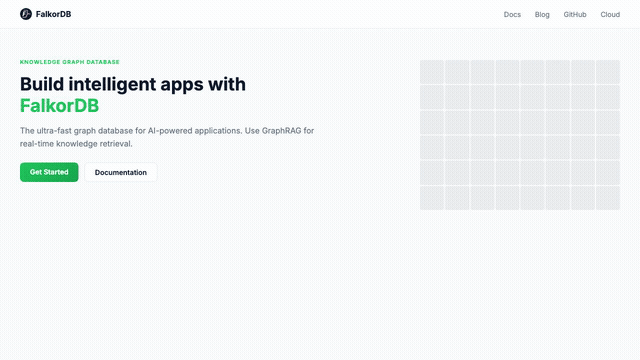

# FalkorDB Chat Widget

An embeddable chat widget powered by **GraphRAG** and **FalkorDB**. Drop a single `<script>` tag on any website to add an AI assistant that answers questions from your knowledge graph — no backend required.


<p align="center">
  
</p>

---

## How It Works

```
User types question → Widget (JS) → GraphRAG-UI Server → GraphRAG SDK → FalkorDB + LLM → Answer
```

The widget is a **pure frontend component** that connects directly to a [GraphRAG-UI](https://github.com/FalkorDB/GraphRAG-UI) server. The server queries a pre-ingested FalkorDB knowledge graph using the GraphRAG SDK, retrieves relevant context, and returns the answer. The widget makes **read-only** requests — no write operations are exposed.

---

## Quick Start

### Script Tag (any website)

```html
<script src="https://unpkg.com/@falkordb/chat-widget"
        data-api="https://your-graphrag-ui-server.com"
        data-graph="my-graph">
</script>
```

### npm (React, Vue, Angular)

```bash
npm install @falkordb/chat-widget
```

```js
import { mount } from '@falkordb/chat-widget';

const unmount = mount({
  api: 'https://your-graphrag-ui-server.com',
  graph: 'my-graph',
});
```

### Local Development

1. Run [GraphRAG-UI](https://github.com/FalkorDB/GraphRAG-UI) locally (provides the API server)
2. Configure a predefined graph in GraphRAG-UI's `.env` (`PREDEFINED_GRAPHS`)
3. Set `WIDGET_ALLOWED_ORIGINS` in GraphRAG-UI's `.env` to allow your embed origin
4. Open `sample.html` and point `data-api` to `http://localhost:8000`

---

## Features

- 🏷️ **One-line embed** — single `<script>` tag, works on any website
- 🧠 **GraphRAG-powered** — queries a FalkorDB knowledge graph via vector + Cypher search
- 🔒 **Read-only** — widget only queries the graph, never writes
- 🆘 **Support escalation** — built-in "Contact Support" form
- 💡 **Suggested questions** — AI-generated starter chips on first open
- 🎨 **Dark theme UI** — polished chat interface with smooth animations
- 📦 **npm + script tag** — use as an npm package or a plain script tag

---

## Configuration

| Attribute | Default | Description |
|-----------|---------|-------------|
| `data-api` | `""` (same origin) | GraphRAG-UI server URL |
| `data-graph` | `falkordb-docs` | Predefined graph id to query |
| `data-title` | `FalkorDB` | Widget header title |
| `data-accent` | `#22C55E` | Brand accent color |
| `data-position` | `bottom-right` | `bottom-right` or `bottom-left` |
| `data-suggestions` | `true` | Set to `"false"` to hide the starter-question suggestions |

---

## API Endpoints Used

The widget calls these **public, read-only** endpoints on the GraphRAG-UI server:

| Endpoint | Method | Description |
|----------|--------|-------------|
| `/api/widget/query?graph_id=...` | POST | Send a question, get an answer |
| `/api/widget/suggestions?graph_id=...` | GET | Get AI-generated starter questions |

These endpoints are unauthenticated, scoped to predefined graphs only, and rate-limited (~1 request per 5 seconds per IP).

---

## License

See [LICENSE](LICENSE) for details.
